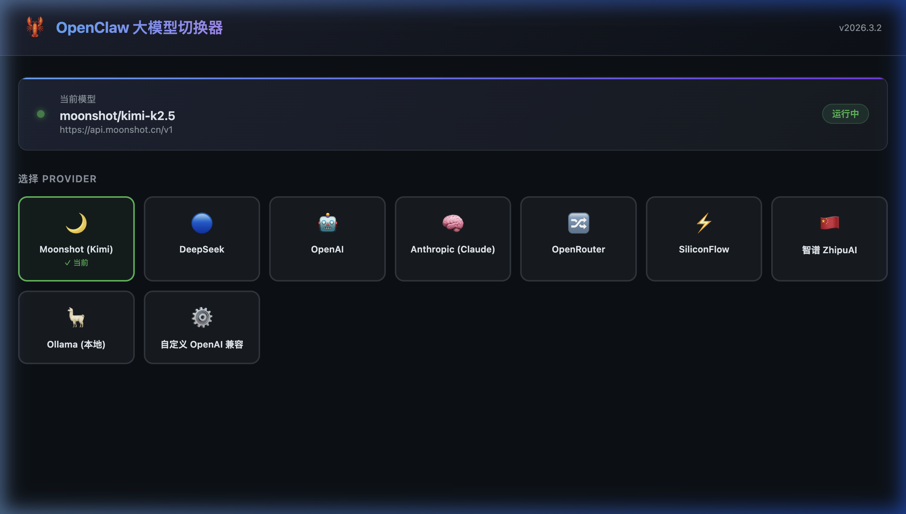
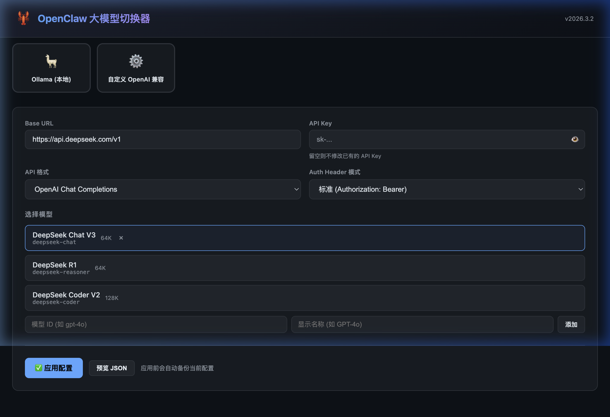

<div align="right">

[中文版](README_CN.md)

</div>

<div align="center">

# 🦞 OpenClaw Model Switcher

A lightweight web-based tool to easily switch LLM providers and models for [OpenClaw](https://openclaw.ai) — no JSON editing required.


</div>

---

## Screenshots

<div align="center">



*Home page: real-time display of the active model, one-click provider selection*



*After selecting a provider, Base URL and model list are automatically populated*

</div>

---

## 🚀 Quick Start

**Prerequisite: OpenClaw must be installed and initialized** (`~/.openclaw/openclaw.json` must exist)

```bash
# Clone the repo
git clone https://github.com/yuanrengu/configadpter.git
cd configadpter

# Start the tool (zero dependencies — no pip install needed)
python3 openclaw_config.py
# Browser opens automatically at http://localhost:7890
```

```bash
# Stop: press Ctrl+C in the terminal
# If running in background, kill the process with:
lsof -ti :7890 | xargs kill -9
```

> **Requirements**: Python 3.8+, standard library only — no `pip install` needed.

---

## Features

| Feature | Description |
|---------|-------------|
| 📊 Live Status | Shows the active provider, model, and base URL at a glance |
| 🎛 Provider Switcher | Click a card to select a provider; Base URL and models auto-fill |
| 🔑 API Key Protection | Leave blank to keep the existing key — it will never be overwritten |
| 🗂 Model Management | Pick from built-in templates or add custom model IDs |
| 💾 Auto Backup | Creates a timestamped backup before every write: `openclaw.json.bak.tool.YYYYMMDD_HHMMSS` |
| 🔍 JSON Preview | Preview the exact changes before applying |
| ♻ Hot Reload Frontend | Edit `index.html` and refresh — no server restart needed |

---

## Supported Providers

| Provider | Base URL | Notes |
|----------|----------|-------|
| 🌙 Moonshot (Kimi) | `api.moonshot.cn` | Available in China, kimi-k2.5 / kimi-latest |
| 🔵 DeepSeek | `api.deepseek.com` | Cost-effective; V3 + R1 reasoning |
| 🤖 OpenAI | `api.openai.com` | GPT-4o, o1, o3, o3-mini |
| 🧠 Anthropic | `api.anthropic.com` | Claude Opus 4.6 / Sonnet 4.6 (latest) |
| ✨ Google Gemini | `generativelanguage.googleapis.com` | Gemini 2.5 Pro / Flash |
| 🔀 OpenRouter | `openrouter.ai/api` | Multi-model aggregation proxy |
| 🚀 Groq | `api.groq.com` | Ultra-fast inference (Llama, DeepSeek, etc.) |
| 🌊 SiliconFlow | `api.siliconflow.cn` | Qwen3, DeepSeek, QwQ — CN-hosted |
| 🇨🇳 ZhipuAI | `open.bigmodel.cn` | GLM-4 series, GLM Z1 reasoning |
| 🦙 Ollama | `localhost:11434` | Locally hosted offline models |
| ⚙️ Custom | Any URL | Any OpenAI-compatible API |

---

## How It Works

When you apply a model switch, the tool **backs up** the current config first, then **only modifies** these 4 areas in `~/.openclaw/openclaw.json`. Everything else is left untouched.

### What Gets Modified

```
models.providers.<provider>          ← Rebuilds the target provider's connection config
auth.profiles.<provider>:default     ← Adds or updates the auth profile entry
agents.defaults.model.primary        ← Sets "provider/modelId" (the core field OpenClaw reads)
agents.defaults.models.<primary>     ← Adds the model alias (display name)
```

**API Key handling**: If the key field is left blank, the existing key is inherited — it will never be lost.

### What Is Never Modified

```
channels.*    ← Telegram / Discord channel settings
gateway.*     ← Port, auth token, node config
tools.*       ← Tool profiles
commands.*    ← CLI settings
session.*     ← Session config
hooks.*       ← Internal hook config
wizard.*      ← Wizard state
Other providers' configurations
```

### Version Number in the Header

The version shown in the top-right corner (e.g. `v2026.3.2`) comes from `meta.lastTouchedVersion` in `openclaw.json`. It is written and maintained by OpenClaw itself — this tool only reads and displays it.

### Does Switching Require an OpenClaw Restart?

**Usually no.** The OpenClaw Gateway monitors `openclaw.json` for changes and hot-reloads most configuration updates automatically.

> **Note**: When switching to a brand-new provider that was never configured before, OpenClaw may need a moment to initialize the new connection. If the new model doesn't take effect immediately, check the OpenClaw web console or restart the OpenClaw process once.

---

## Usage Examples

### Switch to DeepSeek
1. Click the **🔵 DeepSeek** card
2. Enter your DeepSeek API Key (`sk-...`)
3. Select a model (e.g. DeepSeek Chat V3)
4. Click **✅ Apply**

### Switch Back to Moonshot (already configured)
1. Click the **🌙 Moonshot (Kimi)** card (shows "✓ Active")
2. Leave the API Key blank (the existing key is reused automatically)
3. Select a model and click Apply

### Connect Any OpenAI-Compatible API
1. Click the **⚙️ Custom** card
2. Enter the Base URL (e.g. `https://your-api.com/v1`) and API Key
3. Type a model ID and display name, then click **Add**
4. Select the model and click Apply

---

## Project Structure

```
.
├── openclaw_config.py   # Backend: provider templates, HTTP server, config read/write
├── index.html           # Frontend: Web UI (HTML / CSS / JS, dark theme)
├── docs/
│   ├── screenshot_home.png
│   └── screenshot_deepseek.png
└── README.md
```

**OpenClaw paths:**
- Config file: `~/.openclaw/openclaw.json`
- Backup dir:  `~/.openclaw/openclaw.json.bak.tool.*`

---

## Security

- The server only listens on `127.0.0.1:7890` — never exposed to the network
- Every write is preceded by an automatic backup, recoverable from `~/.openclaw/`
- API keys are never pre-filled in the form and never printed to the terminal

---

## License

[MIT](LICENSE)
